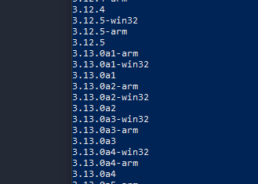

# Установка Pyenv
В powershell вводишь команду:
```
Invoke-WebRequest -UseBasicParsing -Uri "https://raw.githubusercontent.com/pyenv-win/pyenv-win/master/pyenv-win/install-pyenv-win.ps1" -OutFile "./install-pyenv-win.ps1"; &"./install-pyenv-win.ps1"
```
Переоткрываешь powershell
Вводишь эту команду:
```
pyenv --version
```
Должен быть какой-то адекватный вывод
Вводишь это:
```
pyenv install -l
```
У тебя будет куча разных версий



То что с разными буквами, это бета версии и тд. Устанавливай без букв, в моем случае это 3.12.5
Чтобы установить выбранную версию, прописываешь эту команду:
```
pyenv install 3.12.5
```
Чтобы установить версию глобально на всю систему по умолчанию, прописываешь:
```
pyenv global 3.12.5 (В твоем случае будет другая версия мб)
```
Проверяешь что python установился, вводишь:
```
python -c "import sys; print(sys.executable)"
```
<br><br>
# Установка poetry

Вводишь в powershell команду:
```
(Invoke-WebRequest -Uri https://install.python-poetry.org -UseBasicParsing).Content | py -
```
Если будет ошибка какая-то, то введи эту:
```
(Invoke-WebRequest -Uri https://install.python-poetry.org -UseBasicParsing).Content | python -
```
Нужно добавить poetry в переменные окружения, путь такой:
```
%APPDATA%\pypoetry\venv\Scripts\poetry
```
После того как добавишь poetry в переменные, нужно выйти из пользователя либо перезагрузить комп.
Проверяешь установилась ли poetry командой:
```
poetry --version
```
Если все нормально, вводишь команду:
```
poetry config virtualenvs.in-project true
```
<br><br>
# Создание виртуального окружения с помощью poetry

Заходишь в папку и открываешь в ней powershell, в консоли прописываешь
```
poetry init
```
Можешь много раз enter нажимать, пока не закончится создание pyproject.toml файла

Установка библиотек:
```
poetry add openpyxl pandas jupyter
```

Удаление библиотек:
```
poetry remove openpyxl
```

Обычно после того как введешь poetry add у тебя автоматически создается окружение в папке .venv
Если тебе нужно создать новое окружение из файла pyproject.toml, то прописываешь:
```
poetry install
```